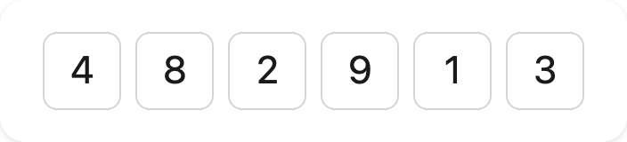
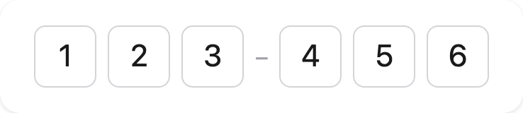
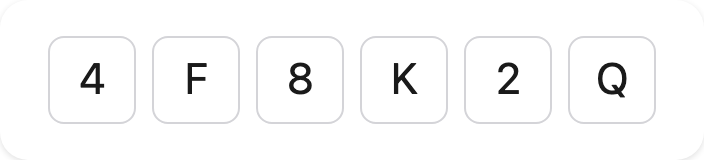
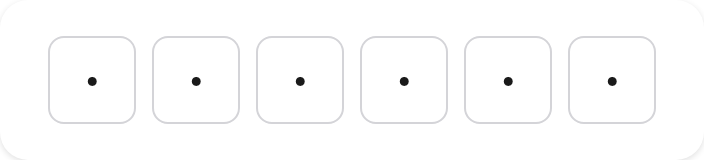
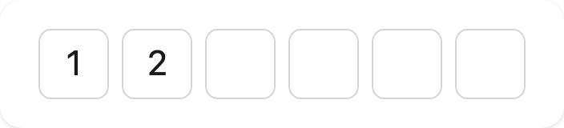
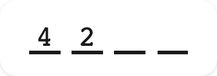
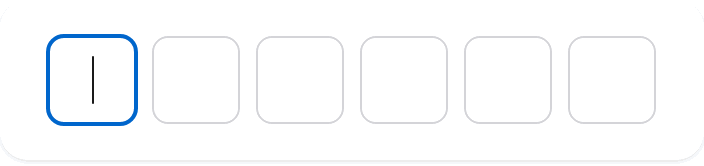
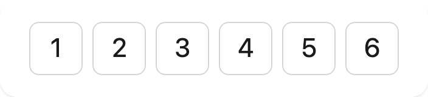

<p align="center">
  
</p>

<h1 align="center">react-otp-slots</h1>

<p align="center">
  <a href="https://github.com/rxova/react-otp-slots/actions/workflows/ci.yml"></a>
  
  
  
  
  
  <a href="./LICENSE"></a>
</p>

**A headless, accessible one-time-code input for React.** One real input underneath, real slots on
top — including the **tap-to-edit any slot** that the incumbent can't do.

```bash
pnpm add react-otp-slots
```

📖 **[Documentation & live examples →](https://rxova.github.io/react-otp-slots/)** — guides, form
recipes, theming, WebOTP, and migration guides from other OTP libraries.

- **One real `<input>`** — paste, SMS autofill, IME, undo, native `<form>` submission and screen-reader
  semantics all come from the platform, not from hand-rolled JavaScript
- **Tap any slot to edit it** — the input's characters sit at their true slot pitch, so a click or tap
  lands the caret where you touched, which a collapsed single-input field physically can't do
- **WebOTP** — programmatic SMS retrieval (`useWebOTP`) that no other OTP library ships
- **Headless** — zero runtime dependencies, no stylesheet to import, ~3.6 kB brotli
- **Form-ready** — string `onChange`, native `name`, and first-class React Hook Form / Formik / React
  Final Form / TanStack Form recipes
- **Correct on the seams** — formatted paste, Chrome auto-translate, IME, RTL, alphanumeric, SSR/RSC

## Basic usage

```tsx
import { OtpInput } from 'react-otp-slots'

const [code, setCode] = useState('')

<OtpInput length={6} value={code} onChange={setCode} onComplete={submit} label="One-time code" />
```

| default                                                                              | grouped `123–456`                                                            | alphanumeric                                                                            | masked                                                                     | invalid                                                                       | render prop                                                                            |
| ------------------------------------------------------------------------------------ | ---------------------------------------------------------------------------- | --------------------------------------------------------------------------------------- | -------------------------------------------------------------------------- | ----------------------------------------------------------------------------- | -------------------------------------------------------------------------------------- |
|  |  |  |  |  |  |


&nbsp;


## Four graduated tiers

One primitive, four levels of control. Simple stays a one-liner; complex stays possible without forking.

```tsx
// Tier 1 — declarative default
<OtpInput length={6} value={code} onChange={setCode} label="One-time code" />

// Tier 2 — compound composition (grouping, separators)
<OtpInput length={6} value={code} onChange={setCode} label="One-time code">
  <OtpGroup><OtpSlot index={0} /><OtpSlot index={1} /><OtpSlot index={2} /></OtpGroup>
  <OtpSeparator>–</OtpSeparator>
  <OtpGroup><OtpSlot index={3} /><OtpSlot index={4} /><OtpSlot index={5} /></OtpGroup>
</OtpInput>

// Tier 3 — render prop
<OtpInput length={6} value={code} onChange={setCode}
  render={({ slots }) => slots.map((s) => <MySlot key={s.index} {...s} />)} />

// Tier 4 — headless hook (own the markup entirely)
const otp = useOtpInput({ length: 6, value: code, onChange: setCode })
```

## Forms

`onChange` emits the sanitized **string**, and the underlying input posts natively under `name`:

```tsx
// Native — the single input IS the field
<OtpInput name="code" length={6} label="Code" />

// React Hook Form (Controller) / Formik / React Final Form — bind value + onChange
<Controller name="code" control={control} render={({ field }) => (
  <OtpInput length={6} label="Code" value={field.value} onChange={field.onChange}
            onBlur={field.onBlur} name={field.name} inputRef={field.ref} />
)} />
```

Recipes for [React Hook Form](https://rxova.github.io/react-otp-slots/recipes/react-hook-form),
[Formik](https://rxova.github.io/react-otp-slots/recipes/formik),
[React Final Form](https://rxova.github.io/react-otp-slots/recipes/react-final-form),
[TanStack Form](https://rxova.github.io/react-otp-slots/recipes/tanstack-form), and
[native forms](https://rxova.github.io/react-otp-slots/recipes/native-forms).

## Styling

No stylesheet to import. Layout-critical CSS is inlined; everything visual is a token or a `data-*` hook.

```css
[data-otp-root] {
  --otp-slot-size: 2.5rem;
  --otp-gap: 0.5rem;
  --otp-radius: 0.5rem;
  --otp-border: 1px solid #d4d4d8;
  --otp-active-ring: 2px solid Highlight;
  --otp-caret-color: currentColor;
}
```

Stable selector hooks (semver-covered): `[data-otp-root]`, `[data-otp-input]`, `[data-otp-slot]`,
`[data-otp-group]`, `[data-otp-separator]`, `[data-otp-caret]`, plus per-slot
`[data-state="filled|active|empty"]`, `[data-active]`, `[data-filled]`, `[data-invalid]`.

## Accessibility

One native text `<input>` — a screen reader announces a single "one-time code, edit text", not "1 of 6"
repeated. Slots are `aria-hidden` decoration. `label` / `aria-label` name the field; `invalid` +
`aria-describedby` wire error text. Verified with axe in CI.

> **iOS note:** the default `slotInteraction="spatial"` auto-degrades to `"crush"` on iOS, which cannot
> fully hide the native `::selection`. Tap-to-edit stays keyboard-plus-caret there; it is full spatial
> everywhere else. Force either mode explicitly with the `slotInteraction` prop.

## License

MIT
